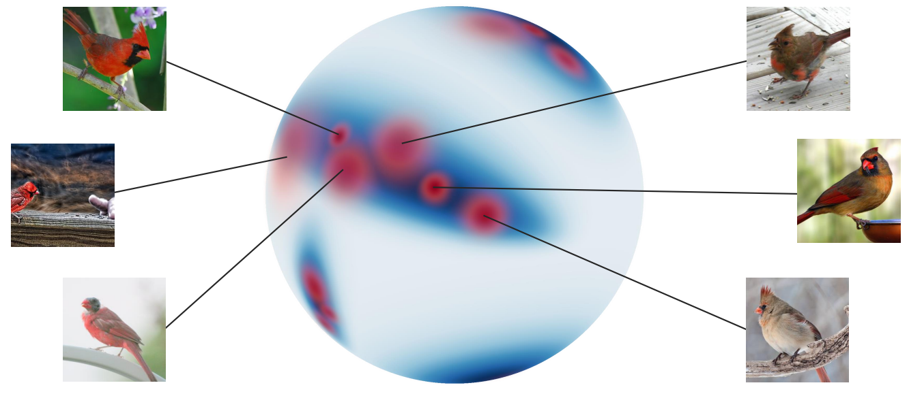

# A Non-isotropic Probabilistic Take on Proxy-based Deep Metric Learning

[Michael Kirchhof]()^, [Karsten Roth]()^, [Zeynep Akata](), [Enkelejda Kasneci]()
_(^) equal contribution_

---



_Proxy-based Deep Metric Learning (DML) learns deep representations by embedding images close to their class representatives (proxies), commonly with respect to the angle between them. However, this disregards the embedding norm, which can carry additional beneficial context such as class- or image-intrinsic uncertainty. In addition, proxy-based DML struggles to learn class-internal structures. To address both issues at once, we introduce non-isotropic probabilistic proxy-based DML. We model images as directional von Mises-Fisher (vMF) distributions on the hypersphere that can reflect image-intrinsic uncertainties. Further, we derive non-isotropic von Mises-Fisher (nivMF) distributions for class proxies to better represent complex class-specific variances. To measure the proxy-to-image distance between these models, we develop and investigate multiple distribution-to-point and distributionto-distribution metrics. Each framework choice is motivated by a set of ablational studies, which showcase beneficial properties of our probabilistic approach to proxy-based DML, such as uncertainty-awareness, better behaved gradients during training, and overall improved generalization performance. The latter is especially reflected in the competitive performance on the standard DML benchmarks, where our approach compares favourably, suggesting that existing proxy-based DML can significantly benefit from a more probabilistic treatment._


Accepted to **[ECCV 2022]()**.

**Link**: https://arxiv.org/pdf/2207.03784.pdf

__BibTeX:__
```
@inproceedings{Kirchhof2022ANP,
  title={A Non-isotropic Probabilistic Take on Proxy-based Deep Metric Learning},
  author={Michael Kirchhof and Karsten Roth and Zeynep Akata and Enkelejda Kasneci},
  booktitle={European Conference on Computer Vision},
  year={2022}
}
```


---
### Requirements.
This repository was tested around
* PyTorch >= 1.8.0 & Faiss-Gpu
* Python 3.8+

To install, with a package manager of your choice, simply install following e.g.
```
conda create -n sample_env python=3.9
conda activate sample_env
conda install matplotlib joblib scikit-image scikit-learn scipy pandas pillow termcolor
conda install pytorch torchvision faiss-gpu cudatoolkit=11.3 -c pytorch
pip install wandb pretrainedmodels timm
```

Our results are computed using standard Deep Metric Learning benchmarks, in particular CUB200-2011, CARS196 and Stanford Online Products. For help on how to install these and correctly set them up, we refer to [Link](https://github.com/Confusezius/Revisiting_Deep_Metric_Learning_PyTorch). To be directly loadable, we expect each dataset to have the following structure: 

_For CUB200-2011/CARS196:_
```
cub200/cars196
└───images
|    └───001.Black_footed_Albatross
|           │   Black_Footed_Albatross_0001_796111
|           │   ...
|    ...
```

_For Stanford Online Products:_
```
online_products
└───images
|    └───bicycle_final
|           │   111085122871_0.jpg
|    ...
|
└───Info_Files
|    │   bicycle.txt
|    │   .
```


---
### Training a probabilistic DML model.

In it's structure, this repository follows the layout and code introduced in ["Revisiting Training Strategies and Generalization Performance in Deep Metric Learning", Roth et al. (2020)](https://github.com/Confusezius/Revisiting_Deep_Metric_Learning_PyTorch).

Exemplary training runs are provided in `example_runs.sh`. In general, training and loss-selection is done following [Roth et al. 2020](https://github.com/Confusezius/Revisiting_Deep_Metric_Learning_PyTorch).
As an example, to train a probabilistic and non-isotropic EL-nivMF regularized ProxyAnchor loss on the CARS196 dataset, simply call

```
parent_folder="path_to_parent_folder"
project="W&B project name"
gpu="gpu_id"

python main.py --loss proxyvmf_panc --seed 0 --gpu $gpu --source_path $parent_folder --project $project --log_online --group Cars196_Prob_RN50_dim128 --dataset cars196 \
--n_epochs 300 --tau 60 80 --gamma 0.1 --no_train_metrics --embed_dim 128 \
--loss_proxyvmf_proxylrmulti 7500 --loss_proxyvmf_conclrmulti 7500 --loss_proxyvmf_concentration 9 --loss_proxyvmf_temp 0.003 --loss_proxyvmf_templrmulti 200 --loss_proxyvmf_warmstart --loss_proxyvmf_n_samples 5 --loss_proxyvmf_guidance_w 0.3
```

which fixed the learning rate multipliers for each proxy and vMF kappas/concentrations (`--loss_proxyvmf_proxy/conclrmulti`), a starting length for each proxy (`--loss_proxyvmf_concentration`), temperature regularizer for the log-PPK (`--loss_proxyvmf_temp` and associated lr multiplier `--loss_proxyvmf_templrmulti`), the number of samples to draw from our vMFs (`--loss_proxyvmf_n_samples`) and finally the weight on the additional ProxyAnchor loss on top of the EL-nivMF objective (`--loss_proxyvmf_guidance_w`). Finally, `--loss_proxyvmf_warmstart` simply denotes one additional epoch at the beginning used to only update the proxies/kappas before training the full pipeline.

In general, all relevant parameters for the EL-nivMF objective are made available in `parameters.py > loss_specific_parameters() > loss_proxyvmf_...`, with the explicit implementation provided in `criteria/proxyvmf_panc.py`, and with `utilities.misc.log_ppk_vmf_vec(...)` containing the vectorized log-PPK implementation, and `utilities.vmf_sampler` the associated vMF sampler implementation.

Finally, borrowed from [Roth et al. 2020](https://github.com/Confusezius/Revisiting_Deep_Metric_Learning_PyTorch), a quick explanation of some other relevant flags (see also `parameters.py` for a list of all possible parameters and flags and a quick description):

* `--loss <loss_name>`: Name of the training objective used. See folder `criteria` for implementations of these methods.
* `--batch_mining <batchminer_name>`: Name of the batch-miner to use (for tuple-based ranking methods). See folder `batch_mining` for implementations of these methods.
* `--log_online`: Log metrics online via either W&B (Default) or CometML. Regardless, plots, weights and parameters are all stored offline as well.
*  `--project`, `--group`: Project name as well as name of the run. Different seeds will be logged into the same `--group` online. The group as well as the used seed also define the local savename.
* `--seed`, `--gpu`, `--source`: Basic Parameters setting the training seed, the used GPU and the path to the parent folder containing the respective Datasets.
* `--arch`: The utilized backbone, e.g. ResNet50. You can append `_frozen` and `_normalize` to the name to ensure that BatchNorm layers are frozen and embeddings are normalized, respectively.
* `--data_sampler`, `--samples_per_class`: How to construct a batch. The default method, `class_random`, selects classes at random and places `<samples_per_class>` samples into the batch until the batch is filled.
* `--lr`, `--n_epochs`, `--bs` ,`--embed_dim`: Learning rate, number of training epochs, the batchsize and the embedding dimensionality.  
* `--evaluate_on_gpu`: If set, all metrics are computed using the gpu - requires Faiss-GPU and may need additional GPU memory.


#### Some Notes:
* During training, metrics listed in `--evaluation_metrics` will be logged for both training and validation/test set. If you do not care about detailed training metric logging, simply set the flag `--no_train_metrics`, which is done in the example runs listed in `example_runs.sh`. 
  
* A checkpoint is saved for improvements in metrics listed in `--storage_metrics` on training, validation or test sets. Detailed information regarding the available metrics can be found in [Roth et al. 2020](https://github.com/Confusezius/Revisiting_Deep_Metric_Learning_PyTorch). As EL-nivMF uses both direction and length of embeddings, for downstream evaluation, we can both look at cosine-distance (`c_recall@k`) and euclidean-distance (`e_recall@k`) based retrievals, where we found cosine-distance based retrieval to be generally preferred.
  
* If one wishes to use a training/validation split, simply set `--use_tv_split` and `--tv_split_perc <train/val split percentage>`.

